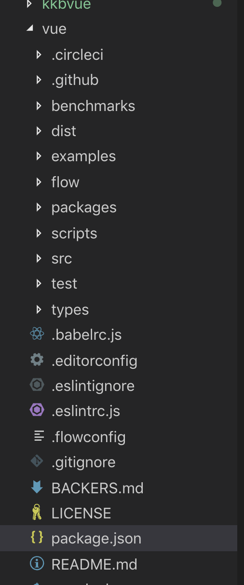

# Vue原理剖析


[TOC]


## 1. 课前准备

作业

1、下列关于vuex描述，不正确的是哪项？(C)[单选题]

A、Vuex 是一个状态管理模式

B、Vuex主要用于多视图间状态全局共享与管理

C、在Vuex中改变状态可以通过mutations和actions

D、Vuex通过Vue实现响应式，因此只能用于Vue

2、下列关于vue-router的描述，不正确的是哪项？(B)[单选题]

A、vue-router有hash和history两种模式

B、可以通过addRoutes和remoRoutes方法动态添加和删除路由

C、可以通过beforeEnter进行路由守卫

D、vue-router之所以能够通过修改hash或者path更新内容，是因为借助了Vue的响应式原理

3、关于typescript在vue中的应用，哪项说法是不正确的？(C)[单选题]

A、使用TypeScript可获得静态类型检查以及最新的ECMAScript特性

B、TypeScript是JavaScript类型的超集，它可以编译成纯JavaScript。意味着你完全可以用JS语法编写TS代码

C、使用Vue.extend({})方式声明组件不能获得TypeScript类型推断能力

D、基于类的Vue组件中如果要声明初始数据可以直接声明为实例的属性，如：`message: string = 'Hello!'`

4、下列关于vue说法哪些是不正确的？(B)[单选题]

A、vue简单易上手，性能高效，还便于与第三方库或既有项目整合

B、vue构建的项目复杂度增加较快，仅适合中小型项目

C、vue基于组件构建应用，代码组织简洁、易理解、易维护

D、vue借助虚拟DOM实现跨平台，服务端渲染，以及性能良好的DOM更新策略

5、下列关于vue-cli说法哪些是不正确的？（BCE）[多选]

A、vue-cli3内部用的webpack来开发

B、vue-cli3自己没法实现数据mock，需要借助easy-mock等平台

C、vue-cli3包含开发的所有功能，基本不需要定制

D、工程化是为了提高开发效率，还可以完成部分实现性能优化的能力

E、npm run test和npm run pretest是两个有先后顺序的命令


## 2. 课堂主题

Vue源码

## 3. 课堂目标

知其然，也知其所以然


## 4. 知识点

### 文件结构




### 入口

package.json, main是require的入口，module是import的入口

```json
  "main": "dist/vue.runtime.common.js",
  "module": "dist/vue.runtime.esm.js",
```

dist是build后产生的，"build": "node scripts/build.js",

所以npm run build执行的事build.js

```js
let builds = require('./config').getAllBuilds()

// filter builds via command line arg
if (process.argv[2]) {
  const filters = process.argv[2].split(',')
  builds = builds.filter(b => {
    return filters.some(f => b.output.file.indexOf(f) > -1 || b._name.indexOf(f) > -1)
  })
} else {
  // filter out weex builds by default
  builds = builds.filter(b => {
    return b.output.file.indexOf('weex') === -1
  })
}

build(builds)
```


config.js

```js

const builds = {
  // Runtime only (CommonJS). Used by bundlers e.g. Webpack & Browserify
  'web-runtime-cjs': {
    entry: resolve('web/entry-runtime.js'),
    dest: resolve('dist/vue.runtime.common.js'),
    format: 'cjs',
    banner
  },
  // Runtime+compiler CommonJS build (CommonJS)
  'web-full-cjs': {
    entry: resolve('web/entry-runtime-with-compiler.js'),
    dest: resolve('dist/vue.common.js'),
    format: 'cjs',
    alias: { he: './entity-decoder' },
    banner
  },
  // Runtime only (ES Modules). Used by bundlers that support ES Modules,
  // e.g. Rollup & Webpack 2
  'web-runtime-esm': {
    entry: resolve('web/entry-runtime.js'),
    dest: resolve('dist/vue.runtime.esm.js'),
    format: 'es',
    banner
  },
  // Runtime+compiler CommonJS build (ES Modules)
  'web-full-esm': {
    entry: resolve('web/entry-runtime-with-compiler.js'),
    dest: resolve('dist/vue.esm.js'),
    format: 'es',
    alias: { he: './entity-decoder' },
    banner
  },
```

cjs是commonjs规范，es标识ES module规范， umd是Universal Module Definition 规范

入口是

### render


### 虚拟dom


###  组件化


### 生命周期


### 组件注册


### 响应式


### 依赖收集


### update


### 编译


### slot


### events


### keep-alive


### vuex


### vue-router


### 


## 5. 扩展


## 6. 总结


## 7. 作业


## 8. 问答


## 9. 预告


